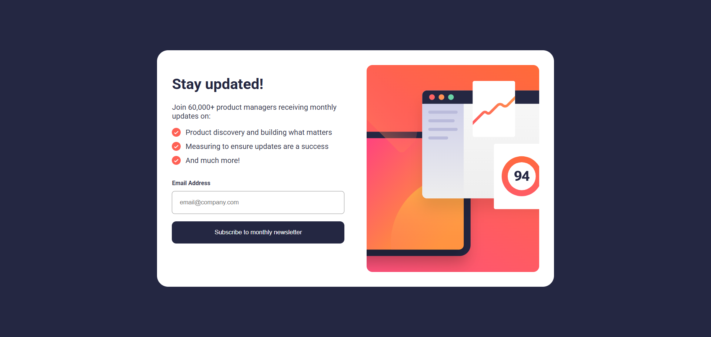

# Newsletter Sign-Up Form with Success Message

This is a solution to the **Frontend Mentor challenge**: Newsletter sign-up form with success message.  
It allows users to subscribe to a newsletter and displays a success message after a valid submission.

---

## 📸 Preview

---

## 🚀 Features

- Responsive design (mobile & desktop)
- Email validation using HTML5 and JavaScript
- Error messages for invalid or empty email
- Success message after form submission
- Smooth layout switching between form and success page

---

## 🛠️ Built With

- HTML5
- CSS3 (Flexbox, Media Queries)
- JavaScript (DOM manipulation, form validation)

---

## 📂 Project Structure

/images  
 icon-list.svg  
 illustration-sign-up-mobile.svg  
 illustration-sign-up-desktop.svg
...

index.html  
style.css  
script.js

---

## ⚙️ How It Works

1. User enters an email address
2. JavaScript checks:
   - If the field is empty → shows "Email is required"
   - If the email is invalid → shows "Valid email required"
3. If valid:
   - Form is hidden
   - Success message is displayed
   - Email is shown in the success text

---

## 📱 Responsive Design

- Mobile-first workflow
- Desktop layout activated at `48rem`

---

## 📌 What I Learned

- Handling form validation with JavaScript
- Using `classList` for dynamic styling
- Managing layout with Flexbox
- Switching between UI states (form / success message)

---

## 🔗 Challenge

This project is based on a Frontend Mentor challenge:  
https://www.frontendmentor.io

---

## ✨ Author

- GitHub: [@Ismaellerakotoson](https://github.com/Ismaellerakotoson)
- Frontend Mentor - [@Ismaellerakotoson](https://www.frontendmentor.io/profile/Ismaellerakotoson)
